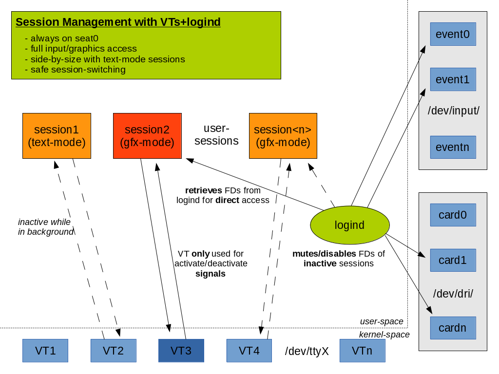
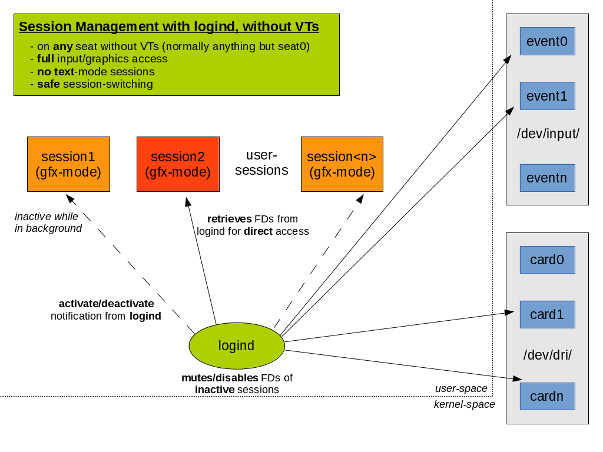

# 精巧的会话切换

说明:本文翻译自David Herrmann的英文博客。

[英文原文](https://dvdhrm.wordpress.com/2013/08/25/sane-session-switching/)

------

在[上一篇文章中](vt-switch.md)，我谈到了VT切换的历史。作为一种在文本模式会话之间切换的简单方式，它已经发展成为一种脆弱的API，用于保护一个庞然怪物（也称为XServer）免受另一个庞然怪物的攻击。XServer过去常常插入PCI条，修改MMIO寄存器，并与DMA控制器混在一起。如果他们拿出大炮，相信一个简单的信号就可以成功谈判几乎是荒谬的。幸运的是，今天的XServer是一个忏悔的罪人。对于普通的桌面硬件，所有的直接I/O都在内核中完成（谢谢KMS！），并且破坏GPU的可能性非常小。这使我们能够在会话切换期间最终实现正确的设备切换。

如果我们从整体上看会话，XServer一点也不特殊。现今可能会运行许多会话守护进程，它们为整个会话提供一些服务。这包括pulseaudio、dbus、systemd–user、colord、polkit、ssh密钥链等等。所有这些守护进程在会话切换期间都不需要任何特殊的同步。那么为什么XServer需要呢？

任何图形服务器（如XServer）都负责向会话提供对输入和图形设备的访问。当会话被激活时，他们需要重新初始化设备。在停用会话之前，他们需要清理设备，以便要激活的会话可以访问它们。他们需要这样做的原因是缺少取消访问权限的基础设施。如果会话无法清理图形设备，内核将阻止任何新会话访问图形设备。对于输入设备，情况甚至更糟：如果会话在停用期间没有关闭设备，它将在新会话处于活动状态时继续读取输入事件。因此，在输入密码时，后台会话可能会将这些按键发送到IRC客户端（这正是XMir所做的）。我们需要的是一个内核特性来强制撤销对图形或输入设备的访问。不幸的是，这并不像听起来那么容易。我们需要找到一个有足够特权和信任的人来做这件事。您不希望后台会话取消前台会话的图形访问权限，是吗？这时systemd-logind进入历史舞台。

systemd-login已开始管理系统上的会话。它跟踪哪个会话处于活动状态，并在/dev中设置ACL以授予前台会话访问设备节点权限。为了实现设备切换，我们在现有的logind api上拓展了一个新函数：RequestDevice（deviceNode）。图形服务器可以将/dev中设备节点的文件系统路径传递给systemd-login，后者检查权限，打开节点并向调用者返回文件描述符。但systemd-login保留了文件描述符的副本。这允许logind在会话处于非活动状态时禁用它。在会话切换期间，logind现在可以禁用旧会话的所有设备，重新启用新会话的设备，并通知两个会话切换。我们现在有了一个从一个会话到另一个会话的干净交接。有了这项技术，我们可以开始研究真实的场景。

## 1) VTs会话管理
会话管理使用VTs进行前台控制，使用login进行设备管理

[基于VT切换](vt-switch.md)的图片，我画了一个新的考虑了logind的图片。VT仍然用于在会话之间切换，但会话不再直接打开硬件设备。相反，他们要求如上所述的登录流程。最大的优点是VT开关不再脆弱。如果VT处于活动状态，则可以确保它具有独占硬件访问权限。如果会话死锁，我们可以强制VT切换并撤销其设备访问权限。这允许从XServer挂起的情况下进行恢复，而无需从远程机器上进行SSH或使用SysRq。

## 2) 无VTs的会话管理
仅基于logind的会话管理

虽然健全的VT切换是一个很好的功能，但最大的优势是我们可以在没有VT的seat上实现适当的多会话支持。虽然以前只有一个会话可以在这样的seat上运行，但通过logind设备管理，我们现在可以在任何seat上支持会话切换。

我们使用 logind dbus api，而不是使用vt在会话被激活或停用时通知会话。图形服务器现在可以通过logind RequestDevice API请求输入和图形设备，并在激活时使用它。一旦发生会话切换，login将禁用设备文件描述符并进行会话切换。dbus信号异步发送到新旧会话。旧会话可以在不活动时停止渲染以节省电源。

## 3) 异步事件和向后兼容性
使用RequestDevice时，有一件事几乎没有被注意到。当会话切换发生时，活动的图形服务器可能几乎要在屏幕上显示图像了。logind撤消对图形设备的访问，并发送一个异步事件，表示会话现在处于非活动状态。但是，图形服务器可能尚未收到此事件。相反，它尝试调用一个系统调用来更新屏幕。但这个操作将得到一个EACCES或EPERM的失败，因为它不再具有访问权限。目前，对于大多数图形服务器来说，这是一个致命错误。它们不是处理EACCES并将其解释为“此设备现在已暂停”。相反它们并不关心错误代码然后直接中止。我们可以修复所有的图形服务器，但为了简化转换，我们引入了协商会话切换。

每当要求logind执行会话切换时，它首先将每个打开设备的PauseDevice信号发送到前台图形服务器。对logind的每个设备要调用PauseDeviceComplete来响应。暂停所有设备后，再执行会话切换。如果前台会话没有及时响应，logind将强制撤销设备访问，然后执行会话切换。

请注意，协商会话交换机制仅用于兼容性。我们强烈建议任何图形服务器都能很好地处理EACCES！

到目前为止，我所有的本地测试都运行良好，但这一切仍在开发中。systemd补丁可以在github上找到（经常重新设置基址！）。我所做的大多数测试都依赖于一个实验性的novt库，该库也可以在github上获得（我将在下周推出它；这仅用于测试！）。欢迎反馈！RFC可以在systemd devel上找到。现在我需要休息一天。

切换愉快！