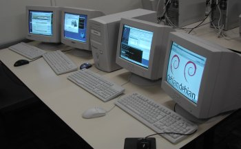

# linux上的会话管理

说明:本文翻译自David Herrmann的英文博客。

[英文原文](https://dvdhrm.wordpress.com/2013/08/24/session-management-on-linux/)

------

我一直钦佩Linux的一件事是它可以快速的进行会话切换。 只需一个简单的键（Ctrl+Alt+Fx）即可，我可以抛弃我的当前会话以切换到另一个会话。虽然原则上会话互动相当简单，但你可能很容易弄错（可以从XMIR看出这一点）。但是，会话管理今天究竟是如何工作的？systemd-logind是如何改变这种情况？

首先，我们需要定义一个会话。 会话是在单个用户的控制下运行的一组进程。 在系统上只有一个会话（更准确地说在seat上，这个后面再讨论）处于激活状态，并且用户只能与活动（或者称做前台）会话交互。 会话可以启动和停止进程，但会话里面的进程无法从会话中脱离出来。 换句话说，所有启动进程都将始终属于启动它们的会话。只有system-daemons（它们未附加到会话）可以产生新的会话。

会话通常有不同的用户守护进程，这些进程为会话提供服务。 例如，X-Server提供了对其他会话进程的图形访问，PulseAudio提供了音频访问。然后有一个控制和监视会话的中央进程。每当生成会话时，此进程就是被创建的第一个进程。 它初始化会话，产生其他管理进程，进程如果崩溃，可以选择性地重新启动它们。如果会话初始化后没有进程需要监控，它也可能退出。 一个例子是gnome-session。

## 1) 会话管理
从历史上看，系统上的每个进程都有一个会话ID，它定义了进程所属的会话。 setsid()系统调用允许创建新会话。 但是，通过systemd-logind引入了一个新的更多功能的概念。要了解这一点，我们需要先看看seats的概念。

### Seats
在单个PC上的多seat上面显示4个监视器，键盘和鼠标

在正常系统上，仅存在一个seat（称为seat0）。但可以根据要求创建更多seat。seat是一个虚拟对象，用于将物理接口描述为系统。将显示器、键盘和鼠标进行组合形成通用的seat。 一个用户可以通过这个seat与系统交互。如果接入了另一个显示器加键盘和鼠标，则另一个用户可以通过一个新的seat（例如，称为seat1）并行与系统交互。值得注意的是，这些seat彼此独立。 你从显示器上获取的画面不同的，并且一个seat上的键盘输入不会影响另一个seat。

连接到您的系统的任何设备都可以连接到seat上，但一次只能连接到一个seat！ 如果设备连接到一个seat上，另一个seat上运行的进程则无法使用这个设备。显然，输入设备，声音设备和监视器通常连接到seat上。例如，网络接口可以保留下来不附加到任何seat，因此所有seat都可以共享Internet连接。 系统管理员可以决定哪个设备附加到哪个seat上，或者将其独立出来作为可以共享的全局设备。

### Bootup
在system-boot期间，systemd启动一系列守护程序来管理系统。 所有这些守护进程都是全局性的，而不是附在seat或session上。 这也意味着，这些守护程序不得访问连接到seat上的设备。在这些守护进程中的systemd-logind，它负责会话和session的管理。

为了允许用户交互，系统需要为每个座位自动产生一个新会话。 这通常是登录会话（如gdm，kdm或lightdm），但也可能被配置为自动登录并直接生成像gnome-session这样的用户会话。 在登录会话的情况下，greeter绘制登录名和密码区域以及验证过程中的输入，它指示Systemd生成用户会话。请注意，greeter不能启动用户会话，因为它已经在一个会话中运行（您无法脱离您的会话，请记住？）。

但systemd在控制会话时究竟做了什么呢？

### 会话
通过内核接口（即cgroups）systemd可以可靠地跟踪进程和他们的子进程。 每当systemd被通知需要启动新会话时，它首先验证调用者是否允许执行此操作，然后它会产生会话的第一个进程。在内部，它将新的会话ID设置到此进程上，保存此会话运行的seat以及其他一些维护数据。 每当此会话进程创建新进程时，systemd都可以使用cgroup来跟踪这些。 因此，它始终知道这些进程属于哪个会话。

会话的第一个进程负责初始化会话。 在gnome-session情况下，它会生成X-Server进程、一些gnome-specific维护的守护进程，然后监视这个会话，以防出现问题。 您现在可以与此会话（通常通过X-Server）进行交互并进行日常工作。

会话可以明确告知systemd来关闭这个会话本身。但是，这其实只会将其标记为死亡而已。 一旦会话的所有进程都退出了后，会话会自动清理并删除。

## 2) 学习案例: 文本模式下的会话
启动过程中的文本模式

作为一个具体的非琐碎情景，我将解释文本模式会话如何与session集成。 首先，我们需要知道虚拟终端基本上是输入设备和监视器的组合。 可以通过访问/dev/tty<num>（其中<num>在1到63之间访问它们;另一个/dev/ttyxy设备没有VTS！）来与这些设备交互。如果您对这个文件进行读取，则会从连接的键盘获取输入，如果您它们进行写入操作，内核将其显示为显示器上的文本。一些相当复杂的控制序列可以达到设置颜色或更多的效果，但这超出了本文的范围。VTS总是绑定到seat0,所以只有这个seat上的会话可以使用VTS（这意味着，经典文本模式仅在seat0上可用）。

文本模式会话是特殊的，因为它们并不是登录会话产生的。在每个VT（您可以配置在这63个中应该启动多少个）的引导期间，Systemd-Logind拉起/bin/agetty进程。 agetty作为系统守护程序运行而不是在会话中运行！ 然而，很显然的，它也是属于seat0的。agetty初始化VT并运行/bin/login。 然后login将greeter写入VT并从中读取用户名和密码。正如您所明白的，这是有问题的，因为它访问了附加到座位的设备，即使它在会话中没有运行。 但由于VTS的设计，这是不可避免的。

一旦login验证了用户的输入后，它指示systemd以文本模式启动给定的用户会话。 它会查找/etc/passwd中指定的初始进程（假设它是/bin/bash）并运行它。因此bash是本次会话中的控制进程。它还代替X-Server，提供用户交互（以文本模式而不是图形）。 它允许在不同的进程（通过Ctrl+Z，fg，bg和jobs）之间切换，并允许在初始化期间启动其他会话守护进程（通过.bashrc）。

因此，虽然感觉文本模式差别很大，但实际上与图形模式还是非常相似的，并且几乎都有对应的等效处理流程。

## 3) 多会话
我们现在明白会话是什么，如何创建它们以及用户如何与它们进行交互。 但是，我们还没有讨论seat上有多个会话的时候会发生什么。

在当前系统上，如果启用VTS（通常是这种情况），则只允许在seat0上允许有多个会话。这意味着，在所有其他seat上，一旦你产生了一个会话，你必须一直使用这个会话。 你不能通过ctrl+alt+Fx（这是历史的原因，我们即将改变这）来离开这个会话。 但是，您可以关闭会话，然后启动一个新的会话。

但如果假设我们的seat支持多个会话，那么这是如何工作的？systemd-logind负责管理和跟踪会话。因此，它为每个会话保留一个active的属性。它是一个布尔值，它定义了会话当前是否处于激活状态。systemd-sogind在每次会话激活的时候会一直关注这个属性的状态。如果没有会话在座位上运行，则不会出现激活状态的会话（也在其他情况下，我们在这里忽略这里是它的实现细节）。此外，systemd-logind将为附加到seat上的设备设置正确的访问限制，使得只有活动会话才能访问这些设备。这保证了后台会话不会干扰前台会话。

要在会话之间切换，每个会话都必须侦听特殊键盘输入（通常是ctrl+alt+Fx），并告诉systemd-logind在这个按键按下后切换到另一个会话。如今，这在X-Server中实现，或者如果没有X-Server在会话中运行，则由底层VT来实现。 您还可以直接向systemd-logind发送DBus调用以执行会话切换（请参阅loginctl激活<sid>）。

因此，对于适当的多会话支持，登录会话在登录期间产生用户会话，但自身会在后台保持活动状态。用户现在可以通过再次登录来在用户会话和登录会话之间切换，并且可选地通过再次登录来产生其他的会话。 会话进程可以在激活或取消激活时侦听来自systemd-logind的DBUS信号。 这允许他们在进入后台时进行睡觉并在进入前台时再次激活。

有关会话切换的深度展示，请参阅此后续文章。