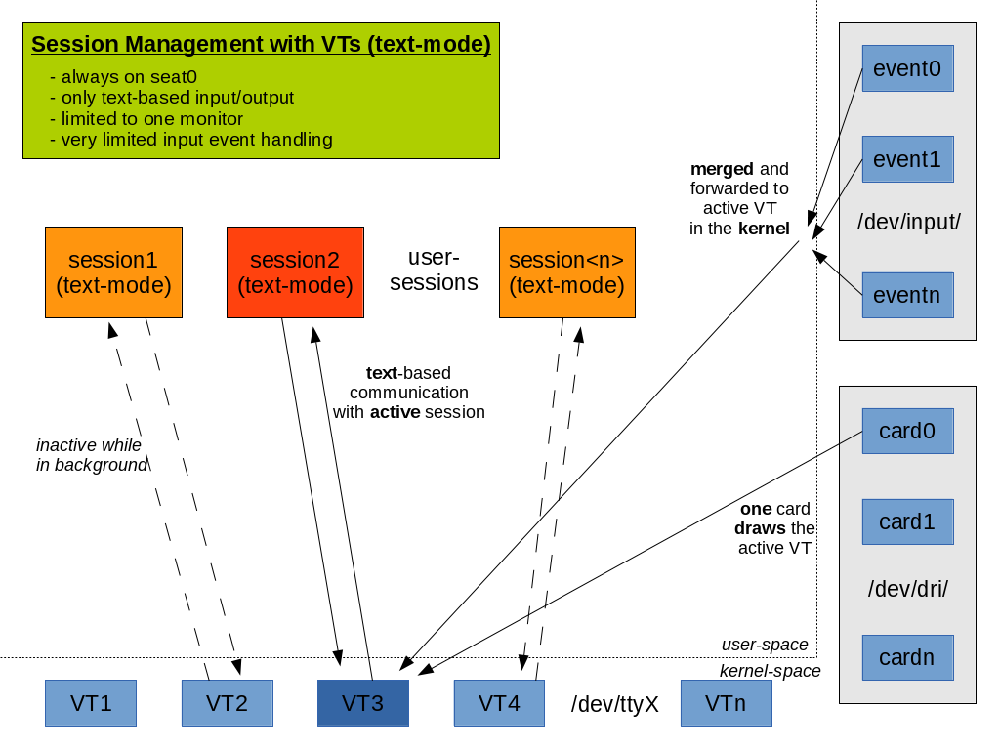
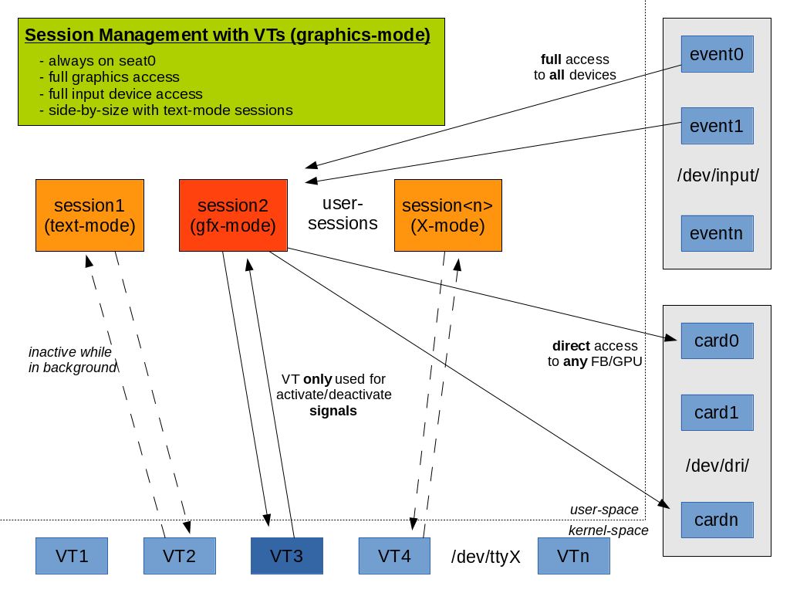
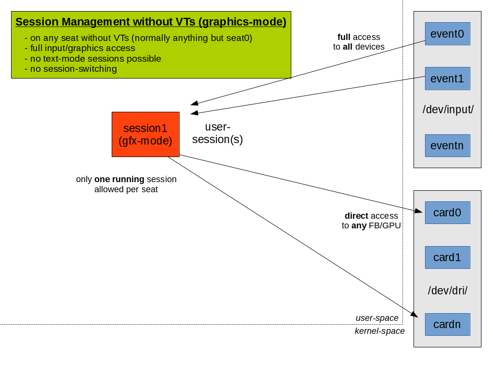

# vt switch 工作原理

说明:本文翻译自David Herrmann的英文博客。

[英文原文](https://dvdhrm.wordpress.com/2013/08/24/how-vt-switching-works/)

------

在系统上同时运行多会话是一件很方便的事情。这样就能够进行快速用户切换或者同时运行两个不同的桌面环境。特别是图形开发人员喜欢它，因为他们可以在他们同一台机器上开发的同时来测试他们的调试XServer/Weston版本。

要了解它的工作原理，我们需要会话的概念。 如果您不熟悉它，请参阅我之前的[会话管理介绍](./session-management.md)。 我希望读者熟悉会话中的基本会话管理概念（即，seats, systemd-logind, login-sessions, user-sessions, 会话中的进程与守护）

## 1) 传统的文本模式vt切换
linux-0.12引入了虚拟终端. 这是Linux上多会话支持的基础。 在此之前，Linux仅支持单个TTY会话（甚至在Linux-0.01的第一个Tarball中被提供）。使用虚拟终端，我们有/dev/tty<num>设备，其中<num>在1和63之间。它们始终绑定到seat0上，并且seat0上的每个会话都绑定到单个vt。 这意味着，seat0最多有63个在线会话。并且任意时刻只有一个vt是活动状态（可以从/sys/class/tty/tty0/active读取）。

linux内核监听键盘事件并通过ctrl+alt+Fx快捷键在两个vt之间进行切换。或者，您可以发出VT_ACTIVATE ioctl以合理的要求内核切换会话。

在过去，所有会话都以文本模式运行。 在文本模式下，一个进程可以通过从VT读取来获得键盘输入，并通过写入VT来写入屏幕。 通过一些相当丑陋的控制序列，来实现颜色或其他高级功能。 内核解释这些并指示图形硬件把指定的这些文本打印出来。

需要特别注意的是，在文本模式下，没有直接访问硬件的途径。 内核将所有键盘事件合并到一个流中，并且会话无法判断它来自哪个设备。 事实上，它甚至无法判断有多少设备。，也包括图形设备。 由于VT仅具有单个输出流，因此只能向单个屏幕输出。多端输出不可用。同时也不支持任何高级图形操作。 但这允许内核将硬件设备的访问权限序列化。 只有活动VT获取输入事件，并且仅活动VT的缓冲区显示在屏幕上。因此也不会发生任何资源冲突。

虽然有方法可以检测到会话何时激活/停用，但在文本模式中，会话通常不关心这些。它只是停止接收键盘输入。 如果会话在停用时写入VT，则会影响VT的内部缓冲区，但不会显示到屏幕。只有激活的VT的缓冲区会显示到屏幕上。

## 2) 图形模式下的vt切换

很快就明确的意识到文本模式是不够用的。我们想要更多！ 这就是我们要介绍的VT图形模式。图形模式不会更改设置，我们仍然有63个VT，每个会话都绑定到一个VT上。 但现在可以将VT从文本模式KD_TEXT切换到图形模式KD_GRAPHICS（通过KDSETMODE ioctl)。 这并不是什么很高端的问题。 真的！ 唯一的作用是禁用内核内部图形例程。 只要VT处于图形模式，内核就不会指示图形硬件在屏幕上显示VT缓冲区。 一旦重置为文本模式并且VT处于活动状态时，内核将再次显示该VT缓冲区。

所以图形模式本身是没有太大用途的。 但同时，内核开始为输入和图形设备提供单独的接口。 因此，虽然VT处于图形模式，但会话可以直接访问图形设备并呈现它们所需的内容。 它还可以忽略VT的输入，然后直接从输入事件接口读取输入事件。 这就是当今XServer的工作原理。

但很明显，在会话切换机期间这将变得有问题。 因为如果内核从图形VT切换，会话需要在激活新会话之前释放图形硬件。 否则，新会话处于活动状态，但您仍然从旧的映像中获取图像。 或者更糟糕的是，它可能会在两个会话的图像之间闪烁。没有内核模式设置(kernel-mode-setting,即KMS)它甚至可能挂起您的图形硬件。

(存在与键盘的KDSKBMode类似的KDSetMode接口。)

不幸的是，内核没有强制撤消图形或输入访问的接口。 因此，vts通过VT_SETMODE IOCTL来拓展。 一个进程可以在VT上发送VT_SETMODE并传入两个信号号码（通常是SIGUSR1和SIGUSR2）参数。 如果内核想要执行VT-Switch，则它将一个这样的信号发送到处于激活状态的VT。 此VT可以清理资源，停止使用图形/输入设备并通过VT_REDDISP IOCTL来确认VT-Switch的请求。 如果进程死锁了导致无法回应该请求，则VT-Switch不会发生！ 这就是为什么崩溃的XServer可以挂起系统。 但如果进程正常发送了VT_RELDISP IOCTL，则内核将执行VT-Switch。 一旦内核切换回给定的VT，它将会发送第二个信号来通知进程需要将之前的vt激活回来。

但是，在每个vt（准确的说是每个会话上）只有一个进程可以调用VT_SETMODE。这已经体现出了这个概念是存在缺陷的。 例如，如果XServer通过VT占有图形和输入设备，则会话中的另一个音频服务器无法对音频硬件对同样的操作。 这对于所有其他设备也是如此。 我在后续文章中讨论涉及登录的替代方案。

## 3) Seats without VTs
我们讨论了VTs总是绑定到seat0上。 因此，如果您在seat0以外的seat上运行会话，或者如果您完全禁用VTs，那么情况变得非常简单：多会话将不支持。 这是Systemd-logind强制设置的，因此活动会话可以在不中断的情况下运行。

同样需要特别注意的是，这不是文本模式。会话必须以图形模式运行，因为内核里面的可解释文本命令设施被绑定到VTs上了。

运行在无vt上的单会话图示：

## 4) logind集成
正如我们在上一篇文章中所讨论的那样，今天systemd-logind跟踪并管理会话。但这该怎样与VTS整合？ systemd前期多年来就支持VTS，为了保存向后兼容性，我们需要保持基础架构。这就是为什么logind需要监控/sys/class/tty/tty0/active文件更改的原因。一旦vt切换发生，logind发出通知它并将旧会话标记为非活动状态，并将新的作为活动状态标记为激活状态。 它还会调整/dev中的ACL，以保持与活动会话同步的访问限制。但是，如果没有竞争仲裁，这就不能正常完成。因此，logind提供了一个新的DBUS-API来替换老化VT API。 建议使用新的会话守护程序来到达支持VTS的效果。
